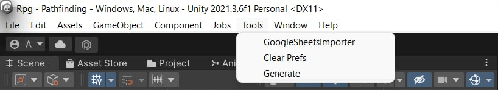
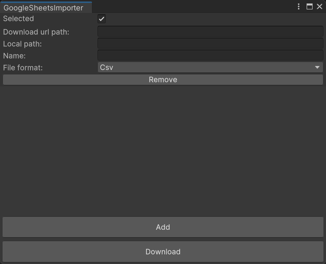
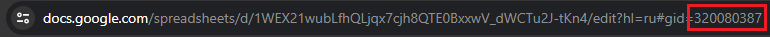

# UnityGoogleSheetsImporter - простой инструмент для импортирования гугл таблиц в ваш Unity проект.
*Read this in other languages: [Русский](https://github.com/AndreyBirchenko/UnityGoogleSheetsImporter/blob/master/README.md), [English](https://github.com/AndreyBirchenko/UnityGoogleSheetsImporter/blob/master/README_en.md)*

## Установка
> **ВАЖНО!** Если вы используете версию Unity ниже чем 2021.3 работоспособность не гарантируется.

## В виде unity модуля
Поддерживается установка в виде unity-модуля через git-ссылку в PackageManager или прямое редактирование `Packages/manifest.json`:
```
"com.anbi.google-sheet-importer": "https://github.com/AndreyBirchenko/UnityGoogleSheetsImporter.git",
```

## Начало работы
> **ВАЖНО!** Не рекомендуется использовать скачивание данных с GoogleDocs в релизных билдах:
> * Время отклика может достигать десятка секунд.
> * Лимит по обращению к документу может быстро переполниться и документ будет заблокирован на какое-то время.

Вы можете скачивать таблицы как походу исполнения программы так и в эдиторе с помощью UI утилиты

### Скачивание с помощью утилиты
> **ВАЖНО!** При скачивании с помощью утилиты всегда будет скачана только первая страница таблицы

Откройте окно загрузки таблиц. Для этого нажмите **Tools -> GoogleSheetsImporter**.



Нажмите **Add** чтобы добавить новую таблицу.



В графу **Download url path:** вставьте [публичную](https://support.google.com/docs/answer/2494822?hl=en&co=GENIE.Platform%3DDesktop#zippy=) ссылку на гугл таблицу
(это та ссылка которая появляется после того как вы нажали кнопку "Поделиться")

В графу **Local path:** добавьте путь куда вы хотите сохранить таблицу
> **ВАЖНО!** Путь уже содержит в себе папку Assets. То есть если вы хотите сохранить таблицу по пути Assets/MyFolder, то достаточно написать только MyFolder. Если директории не нуществует, то она будет создана автоматически.

В графу **Name:** добавьте имя таблицы.

В граве **File format:** выберете нужный формат.

Нажмите **Download** и подождите пока таблица загрузится.

### Скачивание по ходу исполнения программы
```c#
//Публичная ссылка на таблицу
var url = "https://docs.google.com/spreadsheets/d/xxxx/edit?usp=sharing";
var csv = await GSImporter.DownloadCsvAsync(url);

//Вы также можете скачать конкретную страницу по её id
var sheetId = 0;
var concretePageCsv = await GSImporter.DownloadCsvAsync(url, sheetId);
```
Чтобы получить id страницы вам нужно открыть гугл таблицу на нужной странице и скопировать цифры в ссылке после ```#gid=```



## Графа Selected
Если у вас много таблиц и вы не хотите скачивать заново все, вы можете снять галочку Selected с тех, которые не нуждаются в обновлении.
Те таблицы на которых стоит галочка Selected будут скачиваться заново каждый раз при нажатии кнопки Download.