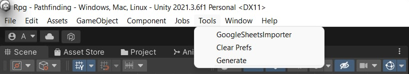
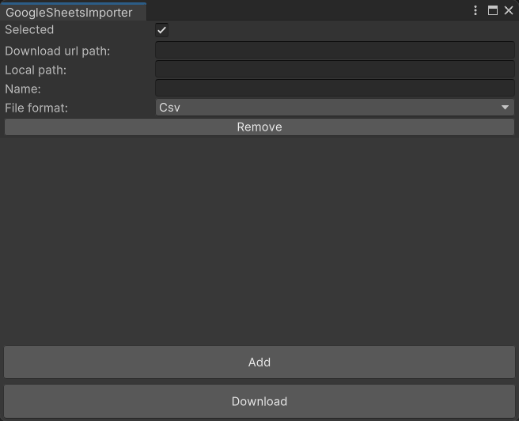
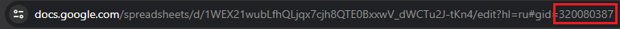

# UnityGoogleSheetsImporter is a simple tool for importing Google tables into your Unity project.
*Read this in other languages: [Русский](https://github.com/AndreyBirchenko/UnityGoogleSheetsImporter/blob/master/README.md), [English](https://github.com/AndreyBirchenko/UnityGoogleSheetsImporter/blob/master/README_en.md)*

## Installation
> **IMPORTANT!** If you are using a Unity version lower than 2021.1, performance is not guaranteed.

## As a unity module
Installation as a unity module via a git link in PackageManager or direct editing of `Packages/manifest.json`:
```
"com.anbi.google-sheet-importer": "https://github.com/AndreyBirchenko/UnityGoogleSheetsImporter.git",
```

## Getting started
> **IMPORTANT!** It is not recommended to use downloading data from Google Docs in release builds:
> * Response time can reach ten seconds.
> * The limit on accessing a document can quickly overflow and the document will be blocked for a while.

You can download tables both after the program execution and in the editor using the UI utility

### Download using the utility
> **IMPORTANT!** When downloading using the utility, only the first page of the table will always be downloaded

Open the table loading window. To do this, click **Tools -> GoogleSheetsImporter**.



Click **Add** to add a new table.



In the column **Download url path:** insert [public](https://support.google.com/docs/answer/2494822?hl=en&co=GENIE.Platform%3DDesktop#zippy=) link to google table
(this is the link that appears after you click the "Share" button)

In the column **Local path:** add the path where you want to save the table
> **IMPORTANT!** The path already contains the Assets folder. That is, if you want to save the table along the Assets/MyFolder path, then it is enough to write only MyFolder. If the directory does not exist, it will be created automatically.

In the column **Name:** add a table name.

In the column **File format:** select the desired format.

Click **Download** and wait for the table to load.

### Downloading during the execution of the program
```c#
//Public link to the table
var url = "https://docs.google.com/spreadsheets/d/xxxx/edit?usp=sharing";
var csv = await GSImporter.DownloadCsvAsync(url);
//You can also download a specific page by its id
var sheetId = 0;
var concretePageCsv = await GSImporter.DownloadCsvAsync(url, sheetId);
```
To get the page id, you need to open the Google spreadsheet on the desired page and copy the numbers in the link after ``#gid=``


## Selected toggle
If you have a lot of tables and you don't want to download everything again, you can uncheck Selected from those that don't need updating.
Those tables with the Selected check mark will be downloaded again every time you click the Download button.
